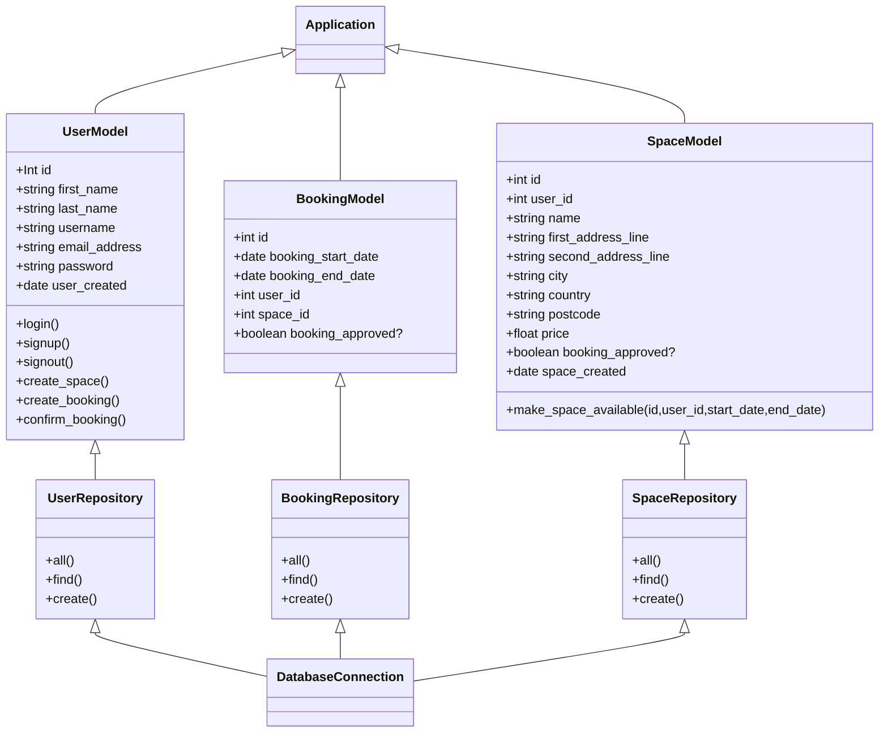

# Class Diagram
[Mermaid live Updated link 10:10](https://mermaid.live/edit#pako:eNqdVV1v0zAU_SuRnzaRVU27pF2FhAZ74WEvDCRAlSI3dos1x45sZ6yM_vddx_lwPqiAp8TnXF-fe-6V_YIySSjaoIxjre8YPiicb0UQVOvgi6bqHgJ4Bz0UOKMD7L2Uj0wcBqjd_IkWUjMj1XEUPUVVyaeI26LgLMOGSdGBd9jgHdb0gxSCZo7bCi80ePv76sovYsT51YzIflltmi6rr9QP7m33g7rjvOP9gH5WFzQuM2iP-6vYwSlnIrdiZHfwYg0PgDxtxZ-a2wS9wZxfXNb_eyZIu8gUxYba5enMJPxnnmGB_5ZlYtzbDB-FCRgJ6pU2CuQGe6a0SQXOaR-HHFNwCVnHKM0x4ykmRFGt-1QBWn5KRZw0wAmIrdKkTjipcS4PTLRFaXYQZdFbytIMak619WoI7lwjOlgKKDL38dPUFdD6xJxPgbes9DLSL23sgzOz9iHlTAx4TUEMOROQMXMcILIURg1AGA5j77pmHLjEJigUyxoEauUUi6CuOcVFoeQTJe_8JlTuDbqQ48fa1hQ_QVPxjtMLRsLagFAbrExqt4cUKrE_l661veHrXSADX30Jjb4u7RTbnDRuiN8jp7pt0lkLTihEOVUwtgTei0rgFpkfFBqKNvBL6B6X3GxR6CjiHpN7rGBIv9qYeD5FfbNU1FA7-fyZPhtHVZtqQkhDO7SNt_Ath1F3IjjddwpyGBh88HYtm2Q5U0qq2wxuC20Jo0pwylaISyMfjiJDG4uFqCysi_XDiDZ7zDWglNiL5r5-Ou0nRAUWaPOCntHmKprHySxaz-fxchXNb5arOERHwJfz2SK5vo6im0WySG7i5SlEv6SEvNFsvYrXyXK1iJL4OlkvqnzfK84KOb0C42OWfA)

# Spaces sequence Diagram
