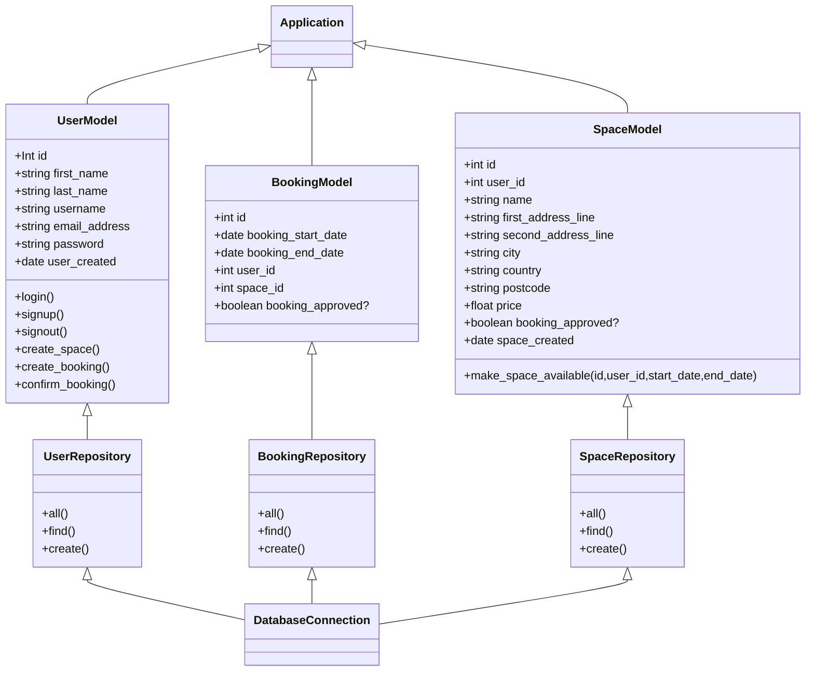

# Class Diagram
[Mermaid live Updated link 10:10](https://mermaid.live/edit#pako:eNqdVV1v0zAU_SuRnzaRVWnabm2EhAZ74WEvDCRAlaLb2C3WHDuynbEy-t9nx_lwPqiAp8bnXB_fe-6t_YIygQlKUMZAqTsKBwn5lgdBtQ6-KCLvTQDroIcCMjLA3gvxSPlhgNrNn0ghFNVCHkfRU1QlPkXcFgWjGWgqeAfegYYdKPJBcE4yx225Fxq8_X115Rcx4vxqRmS_rFamU_Uz9YN72_2g7jjveD-gr-qCxmUG7XF_FTs45Uzklo_sDl6s4YEhT1v-p-Y2QW-AsYvL-ntPOW4XmSSgiV2ezkzCf-oMC_w3lYlxbxU-ch1QHNQrpaVJN9hTqXTKISd93GhMwaVRHaMkB8pSwFgSpfpUYXL5KSSuUWxSrURSlzZOLVKTTBwob-tS9MDLorcUpR6UnSpr1xDcuV50sOCmztzHT1O3QGsVdVYF3rJKmuJ-dWMrnJ-1FSmjfMArYpLBZwIyqo8DRJRcywFo5kPb666ZCCZAB4WkWYOYWhkBHtQ1p1AUUjwR_M7vROXeVCtyeKy9TeHJNBd2jFxQHNYuhEqD1NWGkHC389JNX28IexfJwFw_jybJTnaKbU4ad8VvlMua4imFiUrP-nRCIcqJNOONzbtSFbBF-gcxXUeJ-cRkDyXTWxQ6CrtH5x6kmeSvNmYVTVHfLDVvqJ14_kyetaOqTTXBhSYd2sZb-JaZ_4NLgpF9l0FupgoO3q5FI5ZTKYW8zcytoiyhZWk8sBVCqcXDkWcosViIysL6Uz-gKNkDUwYl2F5I9_UTa39CVABHyQt6Rkm8uJnFm8VyPo9Xy_U6XofoiJJ1PFvGm2i1jK-jeLXYnEL0SwijGc1uruNoGcWRIa436_mqEvtekTaL0yu756Rj)

# Spaces sequence Diagram
