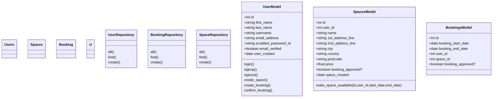

```mermaid
classDiagram
  class Users
  class Spaces
  class Booking
  class U

  class UserRepository {
    all()
    find()
    create()
}
  class BookingRepository {
    all()
    find()
    create()
}
  class SpaceRepository {
    all()
    find()
    create()
}


  class UserModel {
    +Int id 
    +string first_name
    +string last_name
    +string username
    +string email_address
    +string scrabled_password_id
    +boolean email_verified
    +date user_created
    login()
    signup()
    signout()
    create_space()
    create_booking()
    confirm_booking()
}
  class SpacesModel {
    +int id  
    +int user_id
    +string name
    +string 1st_address_line
    +string 2nd_address_line
    +string city
    +string country
    +string postcode
    +float price
    +boolean booking_approved?
    +date space_created
    make_space_available(id,user_id,start_date,end_date)

  }

  class BookingsModel {
    +int id 
    +date booking_start_date
    +date booking_end_date
    +int user_id 
    +int space_id
    +boolean booking_approved?
  }

```
